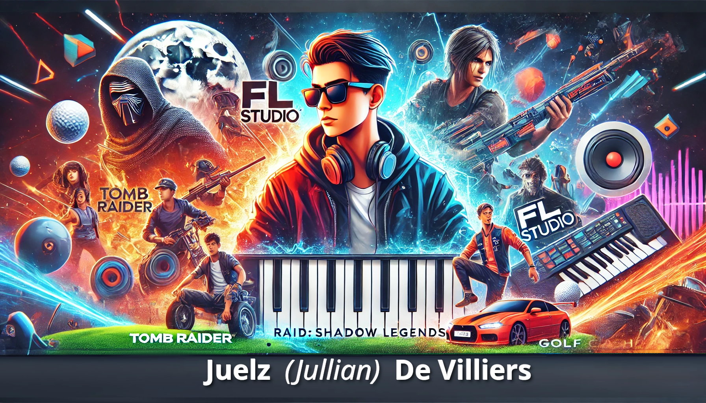

## Jullian Boyd De Villiers
# Commonly Known as _**Juelz**_
---
##### |🖥️ - [Plebware Control Center](https://plebware.github.io/) |⚙️ - [PlebMachine Core](https://plebware.github.io/PlebMachine/) |✍️ - [Otto's Archive](https://plebware.github.io/otto/) | 📚 - [Othello C. Verrocchio](https://www.othelloverrocchio.co.za/) |
---

# 🎧 Julian Boyd De Villiers

## AKA: Juelz • DJ Boy Mist
---
### [Juelz Own GitHub Page](https://juelz-blue.github.io/plebcore/)

Musician • Audio Producer • FL Studio Enthusiast • Creative Collaborator

Welcome to the official archive and creative node of Julian Boyd De Villiers, also known as **Juelz** and **DJ Boy Mist**.

A long-time collaborator within the Plebware and PlebMachine ecosystem, Julian represents the audio and creative production side of the project.

Known as:
> “The other half of Scribble and Scratch.”

---

## 🎼 Audio & Creative Background

Julian has been involved in music production, experimental audio work, remixing, and digital sound engineering for many years.

His creative interests include:

- electronic music production
- beat creation
- audio experimentation
- sound layering
- remix culture
- underground digital music
- atmospheric sound design

---

## 🎹 FL Studio Since 2010

An active **FL Studio user and aficionado since 2010**, Julian has spent years refining his approach to music creation and digital production workflows.

FL Studio became both:
- a creative instrument
- and a production environment

allowing experimentation across multiple styles and soundscapes.

---

## 🎧 Scribble and Scratch

As one half of **Scribble and Scratch**, Julian contributed to collaborative creative concepts involving:

- music
- audio experimentation
- digital production
- underground creative culture
- independent artistic expression

The project evolved organically through experimentation, collaboration, and creative exploration.

---

## ⚙️ Connection to PlebMachine

Within the broader PlebMachine ecosystem, Julian contributes to:

- system audio concepts
- startup sound experimentation
- creative feedback
- multimedia direction
- atmosphere and sonic identity

The collaboration reflects the belief that technology and creativity should work together rather than exist separately.

---

## 🧠 Creative Philosophy

The approach behind the work emphasizes:

- experimentation over perfection
- creativity over conformity
- atmosphere over noise
- originality over trends

The focus has always remained on authentic creation rather than commercial imitation.

---

## 🌐 Linked Systems

### 🖥️ Main Control Hub
- [Plebware Control Center](https://plebware.github.io/Plebware/)

### ⚙️ Technical Core
- [PlebMachine Core](https://plebware.github.io/PlebMachine/)

### ✍️ Writing & Archive
- [Otto Archive](https://plebware.github.io/otto/)

---

## 🚀 Continuing Development

The archive continues to evolve alongside ongoing creative and technical experimentation.

Music, sound, Linux systems, AI experimentation, and digital creativity remain interconnected parts of the broader ecosystem.

---

### 🎧 DJ Boy Mist
Audio • Atmosphere • Experimentation • Digital Creativity
